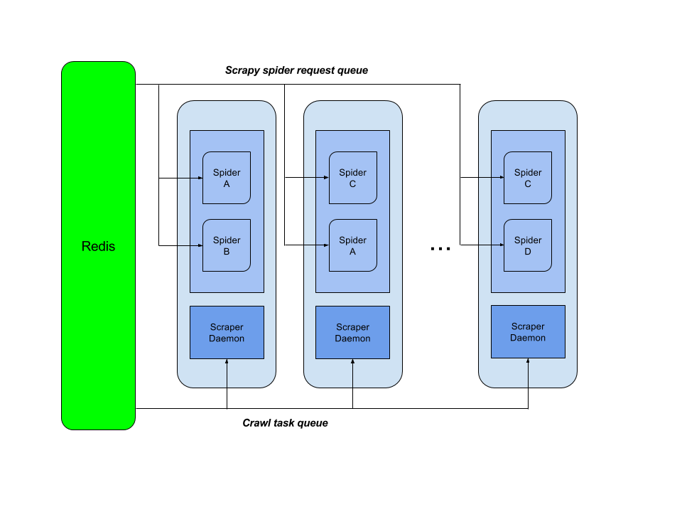

Scraper
===

简介
---

Scraper是一个基于[Scrapy](http://scrapy.org/)修改而来，依靠[Redis](http://redis.io/)实现任务分配的分布式网络爬虫框架，采用[Python](https://www.python.org/)作为开发语言。

架构图
---

组件
---

+ **Scraper daemon**: Daemon应用，从Redis服务器轮询爬虫的任务请求，根据请求创建Scrapy进程来运行对应的爬虫任务。因为Scrapy是基于[Twisted](https://twistedmatrix.com/trac/)的事件驱动模型实现的单线程应用，并且由于Python的全局解释锁的存在，多线程的性能并不理想，所以这里采用了多进程的模型。
+ **Spider A,B,C...**: 具体运行爬虫任务的进程。等同于运行`scrapy crawl [spidername]`，但同样利用Redis进行了分布式的改造，相同的任务可以在多个进程或多台主机上同时运行。

安装和运行
---

+ 安装Python 2.7
+ 安装[pip](https://pypi.python.org/pypi/pip)
+ 运行`git clone https://github.com/LightKool/scraper.git`
+ 运行`cd scraper && python setup.py install`
+ 运行`scraperd`
+ 现在`scraper daemon`已经在运行了，利用任意Redis客户端（控制程序尚未开发完成）运行Redis指令`zadd scraperd:spider:queue 100 "{\"name\": \"[spidername]\"}"`，此时一个新的进程就会被创建并且运行名为[spidername]的Spider（具体参见[Scrapy文档](http://doc.scrapy.org/en/latest/topics/spiders.html)）。